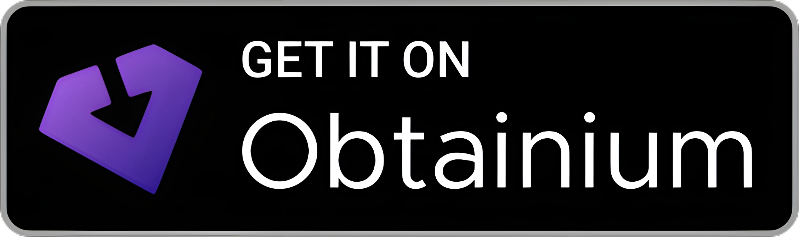

# Milestones

Milestones is an Android app for tracking both long-running milestones and recurring medicine doses in one local-first app.

<p>
  <a href="https://archuser.org/milestones.apk">
    
  </a>
  <a href="https://github.com/firebadnofire/Milestones/releases">
    
  </a>
</p>

Version: `1.4.0`

## What the App Does

Milestones has two main areas:

- `Milestones`: Track the days since or until meaningful events such as habits, anniversaries, and personal goals.
- `Medicines`: Track scheduled doses, daily adherence streaks, and full-screen medicine alarms.

All data is stored locally on-device in `SharedPreferences` as JSON, with import/export support for backups and device transfers.

## Features

### Milestones

- Add milestones with a name and start date.
- View days since a past date or days remaining until a future date.
- Reset a milestone to today with confirmation.
- Show a rolling 7-day reset counter on every milestone card.
- Remove milestones with confirmation.

### Medicines

- Open a separate `Medicines` screen from the navigation drawer.
- Create medicines with:
  - a name
  - one or more scheduled times per day
  - one or more scheduled weekdays
- Track adherence per scheduled dose instead of a single daily yes/no.
- Show each medicine's current streak and today's taken/total summary.
- Mark doses as taken either in-app or from the alarm notification action.
- Schedule alarms with exact alarm support when available.
- Show ongoing full-screen alarm notifications with a `Take dose` action.
- Stop a sounding alarm when the dose is marked taken.
- Use either the system default alarm sound or a user-selected custom alarm sound.
- Remove medicines with confirmation.

### Data and Import/Export

- Import and export app data as JSON from the navigation drawer.
- Persist milestones and medicines together in a versioned app-state payload.
- Keep backward compatibility with older milestone-only JSON exports.

### UI and Platform

- Material-based UI with `RecyclerView` and `ViewBinding`.
- Optional Material You dynamic color support.
- Navigation drawer for milestones, medicines, import/export, and alarm sound settings.

## Tech Stack

- Kotlin
- AndroidX
- Material Components
- RecyclerView
- ViewBinding
- JSON persisted in `SharedPreferences`

## Getting Started

### Prerequisites

- Android Studio
- Android SDK 24 or newer
- JDK 11

The app currently uses:

- `minSdk = 24`
- `targetSdk = 36`
- `compileSdk = 36`

Some medicine reminder behavior also depends on Android-version-specific permissions such as exact alarms, notifications, and full-screen intent access.

### Run the App

1. Open the project in Android Studio.
2. Let Gradle sync complete.
3. Select an emulator or connected device.
4. Run the `app` configuration.

### Build from the Command Line

```bash
./gradlew assembleDebug
```

### Run Tests

```bash
./gradlew test
```

## Project Structure

- `app/src/main/java/org/archuser/milestones/MainActivity.kt`: Milestones screen, navigation drawer, import/export, and milestone creation flow.
- `app/src/main/java/org/archuser/milestones/MedicinesActivity.kt`: Medicines screen, medicine creation flow, drawer actions, permissions, and reminder settings.
- `app/src/main/java/org/archuser/milestones/MedicineReminderScheduler.kt`: Exact-alarm scheduling and reminder timing logic.
- `app/src/main/java/org/archuser/milestones/MedicineReminderReceiver.kt`: Alarm receive/take-dose handling and rescheduling.
- `app/src/main/java/org/archuser/milestones/MedicineAlarmService.kt`: Foreground alarm playback and full-screen notification handling.
- `app/src/main/java/org/archuser/milestones/AppStateStorage.kt`: Versioned root app-state JSON encoding and decoding.
- `app/src/main/java/org/archuser/milestones/MilestoneStorage.kt`: Milestone JSON encoding and decoding, including reset history.
- `app/src/main/java/org/archuser/milestones/MedicineStorage.kt`: Medicine JSON encoding and decoding, including schedule and dose logs.
- `app/src/main/java/org/archuser/milestones/MilestoneStats.kt`: Milestone calculations such as rolling reset counts.
- `app/src/main/java/org/archuser/milestones/MedicineStats.kt`: Medicine streak, schedule, and dose-summary calculations.
- `app/src/main/res/layout/`: Layouts for milestones, medicines, drawer content, and reminder-related UI.
- `appicon.png`: Source image copied into generated Android drawable resources during build.

## Notes

- The app is local-first and does not require an account or backend service.
- Release signing is configured through environment variables when present.

## License

See [LICENSE](LICENSE).
